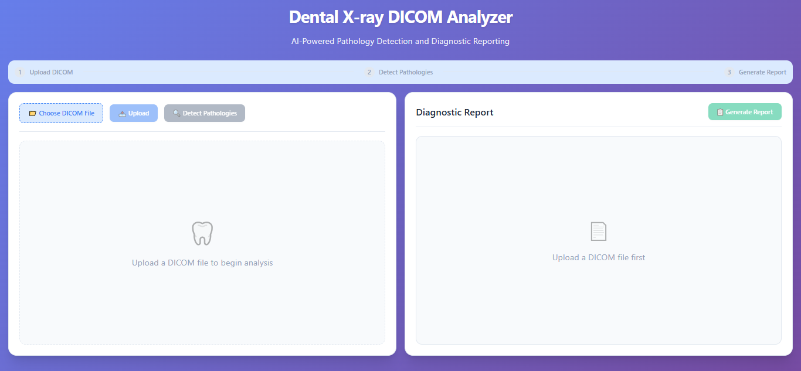
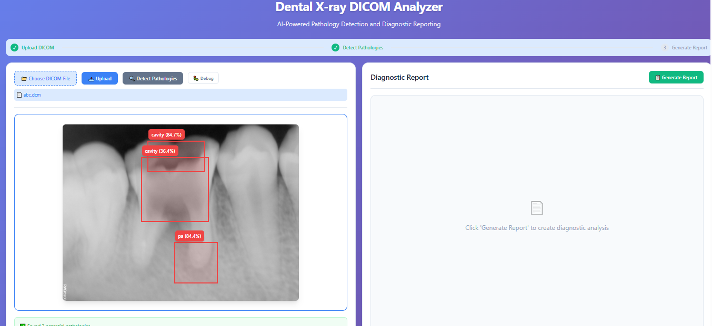
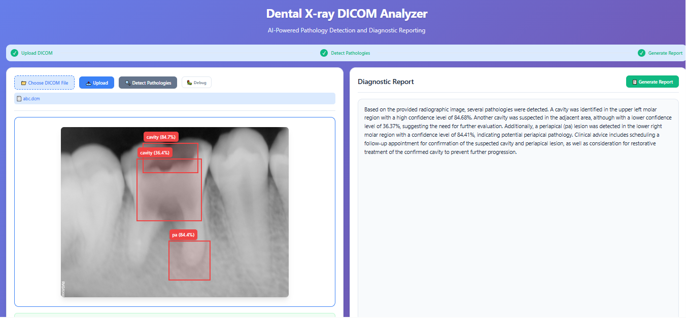

# Dental DICOM Analyzer

A full-stack web application for dental X-ray DICOM analysis. This tool allows dentists and radiologists to upload dental X-ray DICOM images, automatically detect pathologies using AI, and generate clinical diagnostic reports.





## 🚀 Features
- Upload and view dental X-ray DICOM images (.dcm, .rvg)
- AI-powered pathology detection (cavities, periapical lesions)
- Interactive bounding box visualization with confidence scores
- LLM-generated diagnostic report in clinical language
- Responsive UI for desktop and mobile devices

## 🏗️ Architecture

```
┌─────────────────┐     ┌──────────────────┐     ┌───────────────────┐
│                 │     │                  │     │                   │
│  React Frontend │═════│  FastAPI Backend │═════│  External APIs    │
│  (Vite, JS)     │     │  (Python)        │     │  (Roboflow, Groq) │
│                 │     │                  │     │                   │
└─────────────────┘     └──────────────────┘     └───────────────────┘
        │                        │                        
        ▼                        ▼                        
┌─────────────────┐     ┌──────────────────┐             

│                 │     │                  │             

│  User Interface │     │  DICOM Storage & │             

│  Components     │     │  Processing      │             

│                 │     │                  │             

└─────────────────┘     └──────────────────┘             
```

### Data Flow
1. User uploads DICOM file through the frontend
2. Backend converts DICOM to PNG for visualization
3. PNG is sent to Roboflow for object detection
4. Annotations and bounding boxes are returned to frontend
5. Annotations are sent to Groq LLM to generate diagnostic report
6. Report is displayed alongside annotated image

## 💻 Tech Stack

### Frontend
- **React** - UI library
- **Vite** - Build tool and development server
- **JavaScript** - Programming language
- **CSS3** - Styling and responsive design

### Backend
- **FastAPI** - API framework
- **Python 3.12** - Programming language
- **pydicom** - DICOM file handling
- **PIL/Pillow** - Image processing
- **Groq Client** - LLM API integration

### External APIs
- **Roboflow** - Object detection model (cavities and periapical lesion detection)
- **Groq** - LLM for diagnostic report generation

## 🔧 Setup and Installation

### Backend Setup
1. Navigate to the backend directory:
   ```powershell
   cd backend
   ```

2. Create a virtual environment:
   ```powershell
   python -m venv venv
   .\venv\Scripts\Activate
   ```

3. Install dependencies:
   ```powershell
   pip install -r requirements.txt
   ```

4. Create a `.env` file with your API keys:
   ```
   ROBOFLOW_API_KEY=your_roboflow_api_key
   GROQ_API_KEY=your_groq_api_key
   ```

5. Start the FastAPI server:
   ```powershell
   uvicorn main:app --reload
   ```
   The API will be available at http://127.0.0.1:8000

### Frontend Setup
1. Navigate to the frontend directory:
   ```powershell
   cd frontend
   ```

2. Install dependencies:
   ```powershell
   npm install
   ```

3. Start the development server:
   ```powershell
   npm run dev
   ```
   The frontend will be available at http://localhost:5173

## 📁 Project Structure
```
dental_dicom_analyzer/
├── backend/                     # FastAPI backend
│   ├── main.py                  # Main API endpoints
│   ├── requirements.txt         # Python dependencies
│   ├── .env                     # API keys (not in repo)
│   ├── uploads/                 # Uploaded DICOM & converted images
│   └── annotations/             # Stored AI annotations
├── frontend/                    # React Vite frontend
│   ├── src/                     # Source code
│   │   ├── App.jsx              # Main application component
│   │   ├── App.css              # Styling
│   │   └── main.jsx             # Entry point
│   ├── public/                  # Static assets
│   ├── package.json             # JavaScript dependencies
│   └── vite.config.js           # Vite configuration
├── Images/                      # Sample DICOM files for testing
└── README.md                    # Project documentation
```

## 📋 API Endpoints
- `GET /` - Health check
- `POST /upload/` - Upload DICOM file and convert to viewable format
- `GET /file/{filename}` - Get converted image
- `POST /predict/?file_id={file_id}` - Detect pathologies using Roboflow
- `POST /report/?file_id={file_id}` - Generate diagnostic report using LLM

## 🎬 Demo

[Watch the demo video](placeholder-for-demo-video-link)


